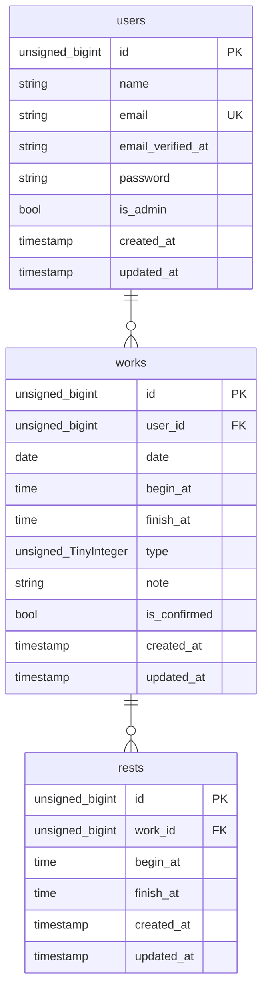

# AttendanceManagementApp

## 環境構築 (Mac)
### Mac,Makefileを使用する場合
1. `git clone https://github.com/itoro967/AttendanceManagementApp.git`
1. `cd AttendanceManagementApp`
1. `make init`
1. 完了
### Mac,コマンドラインを使用する場合
#### Dockerビルド
1. `git clone https://github.com/itoro967/AttendanceManagementApp.git`
1. `cd AttendanceManagementApp`
1. `docker compose up -d --build`
#### Laravel環境構築
1. `docker compose exec php bash`
1. `composer install`
1. `cp .env.example .env`
1. `php artisan key:generate`
1. `php artisan migrate`
1. `php artisan db:seed`
1. 完了

### 仕様技術
- Laravel 10.48.25
- MailHog ※最新版を使用
- nginx 1.27.2
- MySQL 9.0.1
- PHP 8.2-fpm

## ログイン情報

|種別|名前|メールアドレス|パスワード|
|-|-|-|-|
管理者|admin|admin@admin.jp|password|
一般ユーザー|hoge|hoge@hoge.jp|password|

## URL
- 開発環境: http://localhost/
  - 管理者ログイン: http://localhost/admin/login
  - 一般ユーザーログイン: http://localhost/login
- MailHog: http://localhost:8025/

## 備考
- 打刻操作は1秒以内に2回以上しないこと

## ER図
